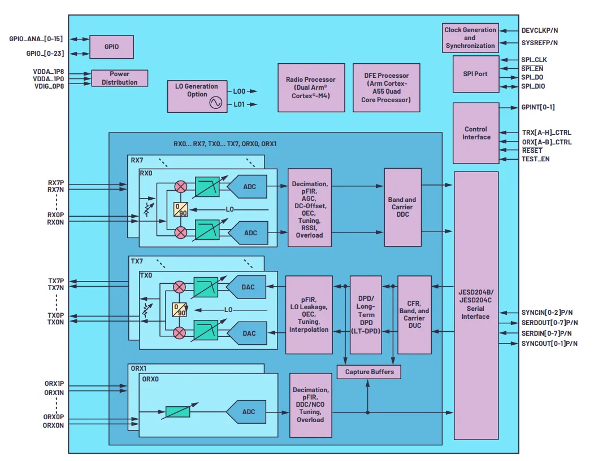

## 仓库概述 ：

本仓库用于汇总ADRV904X(ADRV9040/ADRV9044)相关资料文档 。

仓库目录如下 ：

[datasheet](datasheet) ：该目录下放置ADRV904X的芯片手册和产品介绍 。

[drivers](drivers) ： 该目录下放置ADRV904X的linux驱动程序 。
[evaluation-hardware](evaluation-hardware) ： 该目录下放置ADRV904X的官方硬件评估板设计文件 。
[user-guides](user-guides) ： 该目录下放置ADRV904X的官方用户指导手册 。

## ADRV9040 官网资料链接 

**ADRV9040 官网链接 ：**[ADRV9040数据手册和产品信息 | Analog Devices](https://www.analog.com/cn/products/adrv9040.html)

**ADRV9040用户指南链接 ：**[ADRV9040 Prototyping Platform User Guide ](https://wiki.analog.com/resources/eval/user-guides/adrv904x)

**ADRV9040官方评估板链接 ：** [EVAL-ADRV904x | Analog Devices](https://www.analog.com/en/resources/evaluation-hardware-and-software/evaluation-boards-kits/EVAL-ADRV904x.html)

**ADRV9040 linux驱动介绍使用链接 ：**[ADRV904x Integrated Radio Frequency Transceiver Linux device driver ](https://wiki.analog.com/resources/tools-software/linux-drivers/iio-transceiver/adrv904x)

**ADRV9040 / ADRV9044 硬件设计参考文件** ：（ 该链接时不时就访问失败 ahh ） 

ADRV9044 ： https://www.analog.com/media/en/engineering-tools/design-tools/adrv9044-design-files.zip

ADRV9040 ： https://www.analog.com/media/en/engineering-tools/design-tools/adrv9040-design-files.zip

## ADRV904X介绍文章 ：

[ADRV9040发布了--来看看她有哪些升级吧 (微信公众号)](https://mp.weixin.qq.com/s/3oEQMYb3fHty1baTThLKeg)

[新射频收发器发布：ADRV9040，具有DFE、400MHz BW的8T8R SoC (微信公众号)](https://mp.weixin.qq.com/s/B3uh4Z8sIPrmBo4A0LNY-g)

[ADI公司的RadioVerse SoC帮助提高5G射频的效率和性能-美通社PR-Newswire (prnasia.com)](https://www.prnasia.com/story/344714-1.shtml)

## ADRV904X 概述 。

ADRV9040是ADI的第六代Transceiver产品，代号为Koror ，ADRV9040的页面的标签状态为“推荐新设计使用”，对应的数据手册也可以下载了。

ADRV9040目前有两个子型号：8T8R版本的ADRV9040，以及4T4R版本的ADRV9044。二者在器件规格、功能模块、管脚定义上是一致的，仅仅是通道数的差别 。

 **特性**

- 8个差分发送器（Tx）

- 8个差分接收器（Rx）

- 2个观察接收器（ORx）

- 单频段和多频段（N x 2T2R/4T4R）能力
  
    - 可调范围（**注1**）内4个波段轮廓
    
- 调谐范围：650 MHz至6000 MHz

- 400MHz iBW DPD支持
  
    - 通过硬件加速电荷捕捉纠正算法实现GaN PA支持
    
- 支持JESD204B/JESD204C数字接口

- 适用于所有LO和基带时钟的多芯片相位同步

- 完全集成的N部射频频率合成器

- 简化系统散热解决方案
    - 所有区块实现13W功耗（**注2**）
    - 110°C最高结温，工作温度最高达125°（**注3**）
    
- 完全集成的DFE（DPD、CDUC、CDDC、CFR）引擎，免除FPGA的需要，SERDES通道速率减半
    - DPD自适应引擎，实现功率放大器的线性化
    - CDUC/CDDC——每个Tx/Rx通路最多8个分量载波（CC）
    - 多级CFR引擎
    
- 完全集成的时钟频率合成器

    

（**注1**）波段轮廓定义信道带宽和总采样率。 

（**注2**）使用案例是TDD 200 MHz瞬时带宽和200 MHz占用带宽，所有区块（DPD、CFR、CDUC/CDDC）启用。

（**注3**）根据加速因子，110°C时的工作寿命影响可由<110°C时的运行补偿。

**更多细节**

ADRV9040是一款高度集成的片上系统（SoC）射频（RF）捷变收发器，配有集成式数字前端（DFE）。SoC包含8个收发器、2个用于监测发射器通道的观测接收器、8个接收器、集成LO和时钟合成器，以及数字信号处理功能。SoC满足蜂窝基础设施应用（包括小型蜂窝基站无线电、宏3G/4G/5G系统和大规模MIMO基站）所需的高射频性能和低功耗。

Rx和Tx信号路径采用零中频（ZIF）架构，提供适合连续和非连续多载波基站应用的宽带宽和动态范围。ZIF架构具有低功耗+射频和带宽灵活等优点。由于没有混叠和带外图像，因而不需要抗混叠和图像滤波器。这样就减小了系统尺寸和成本，同时支持与频带无关的解决方案。

该器件还包括两个宽带宽观测路径接收器子系统，用于监测发射器输出。该SoC子系统包括自动和手动衰减控制、直流失调校正、正交误差校正 (QEC) 以及数字滤波功能。此外，还集成了提供一系列数字控制选项的GPIO。

双LO功能、额外的LO分频器和宽带宽操作支持多频段功能。这样就在可调谐范围内有4个单独的频带曲线1，从而尽可能提高用例灵活性。

SoC具有完全集成的数字前端（DFE）功能，包括载波数字上/下变频（CDUC和CDDC）、削峰（CFR）、数字预失真（DPD）、闭环增益控制（CLGC）和电压驻波比（VSWR）监控。

ADRV9040的CDUC功能对目标频带内的单独分量载波进行滤波和放置。CDDC功能具有8个并行路径，对每个载波进行单独处理，再通过串行数据接口发送。

CDUC和CDDC降低了非连续载波配置中的SERDES接口数据速率。与基于FPGA的等效实现方案相比，这种集成设计还降低了功耗。

ADRV9040的CFR引擎降低了输入信号的峰均比（PAR），支持实现更高效率的传输线路升级，同时降低了基带处理器的处理负荷。

SoC还包含完全集成的DPD引擎，用于功率放大器（PA）线性化。DPD支持高效功率放大器，可减少基站无线电的功耗，以及与基带处理器接口所需的SERDES通道数量。DPD引擎包含一个长期专用的DPD (LT-DPD)模块，可为GaN PA提供支持。ADRV9040利用其LT-DPD模块解决了GaN PA的电荷捕获特性；因此改善了辐射和EVM性能。SoC包括一个ARM Cortex-A55四核处理器，可独立提供DPD、CLGC和VSWR监控功能。专用处理器与DPD引擎一起提供行业出色的DPD性能。

串行数据接口包括八个串行器通道和八个解串器通道。该接口支持JESD204B和JESD204C标准，支持固定和浮点数据格式。浮点格式使内部自动增益控制（AGC）对基带处理器可见。

ADRV9040可直接由0.8V、1.0V和1.8V稳压器供电，并通过一个标准SPI串行端口进行控制。全面的节电模式可尽量降低正常使用时的功耗。该器件采用27mm × 20mm、736引脚球栅阵列封装。

**应用**

- 3G/4G/5G TDD/FDD小型蜂窝、大规模MIMO和宏基站

