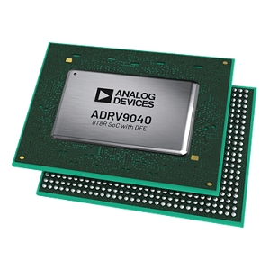

# ADRV9040 Prototyping Platform User Guide

## Overview

The [ADRV9040](https://www.analog.com/en/products/adrv9040.html) is a highly integrated, system on chip (SoC) radio frequency (RF) agile transceiver with integrated digital front end (DFE). The SoC contains eight transmitters, two observation receivers for monitoring transmitter channels, eight receivers, integrated LO and clock synthesizers, and digital signal processing functions. The SoC meets the high radio performance and low power consumption demanded by cellular infrastructure applications including small cell basestation radios, macro 3G/4G/5G systems, and massive MIMO base stations.

## Supported carriers

- [ADRV904x-MB/PCBZ](https://www.analog.com/en/products/adrv9040.html)

## Table of Contents

People who follow the flow that is outlined, have a much better experience with things. However, like many things, documentation is never as complete as it should be. If you have any questions, feel free to [ask](https://wiki.analog.com/resources/eval/user-guides/ad-fmcomms2-ebz/help_and_support).

1. Use the board to better understand the ADRV9040
    1. [What you need to get started](https://wiki.analog.com/resources/eval/user-guides/adrv904x/prerequisites)
    2. [Quick Start Guides](https://wiki.analog.com/resources/eval/user-guides/adrv904x/quickstart)
        1. [Linux on ZCU102](https://wiki.analog.com/resources/eval/user-guides/adrv904x/quickstart/zynqmp)
        2. [Configure a pre-existing SD-Card](https://wiki.analog.com/resources/tools-software/linux-software/zynq_images#preparing_the_image)
        3. [Update the old card you received with your hardware](https://wiki.analog.com/resources/tools-software/linux-software/zynq_images#staying_up_to_date)
    3. Linux Applications
        1. [IIO Scope](https://wiki.analog.com/resources/tools-software/linux-software/iio_oscilloscope)
            1. [ADRV904x IIO Scope View](https://wiki.analog.com/resources/tools-software/linux-software/adrv904x_osc_main)
2. Design with the ADRV904x
    1. [Understanding the ADRV9040](https://wiki.analog.com/resources/eval/user-guides/adrv904x/adrv904x)
        1. [ADRV9040 Product page](https://www.analog.com/en/products/adrv9040.html)
        2. [Full Datasheet and chip design package](https://www.analog.com/en/products/adrv9040.html#product-documentation)
    2. Hardware in the Loop / How to design your own custom BaseBand
        1. [GNU Radio](https://wiki.analog.com/resources/tools-software/linux-software/gnuradio)
        2. [Transceiver Toolbox](https://wiki.analog.com/resources/tools-software/transceiver-toolbox)
    3. Design a custom ADRV904x based platform
        1. Linux software
            1. [ADRV904x Integrated Radio Frequency Transceiver Linux device driver](https://wiki.analog.com/resources/tools-software/linux-drivers/iio-transceiver/adrv904x)
                1. [ADRV904x Device Driver Customization](https://wiki.analog.com/resources/tools-software/linux-drivers/iio-transceiver/adrv904x-customization)
                2. [Customizing the devicetree on the target](https://wiki.analog.com/resources/eval/user-guides/ad-fmcomms2-ebz/software/linux/zynq_tips_tricks)
            2. [JESD204 (FSM) Interface Linux Kernel Framework](https://wiki.analog.com/resources/tools-software/linux-drivers/jesd204/jesd204-fsm-framework)
            3. [AD9528 Low Jitter Clock Generator Linux Driver](https://wiki.analog.com/resources/tools-software/linux-drivers/iio-pll/ad9528)
            4. [AXI-DMAC DMA Controller Linux Driver](https://wiki.analog.com/resources/tools-software/linux-drivers/axi-dmac)
            5. [JESD204B Transmit Linux Driver](https://wiki.analog.com/resources/tools-software/linux-drivers/jesd204/axi_jesd204_tx)
                1. [JESD204B Status Utility](https://wiki.analog.com/resources/tools-software/linux-software/jesd_status)
            6. [JESD204B Receive Linux Driver](https://wiki.analog.com/resources/tools-software/linux-drivers/jesd204/axi_jesd204_rx)
                1. [JESD204B Status Utility](https://wiki.analog.com/resources/tools-software/linux-software/jesd_status)
            7. [JESD204B/C AXI_ADXCVR Highspeed Transceivers Linux Driver](https://wiki.analog.com/resources/tools-software/linux-drivers/jesd204/axi_adxcvr)
                1. [JESD204 Eye Scan](https://wiki.analog.com/resources/tools-software/linux-software/jesd_eye_scan)
            8. [AXI ADC HDL Linux Driver](https://wiki.analog.com/resources/tools-software/linux-drivers/iio-adc/axi-adc-hdl)
            9. [AXI DAC HDL Linux Driver](https://wiki.analog.com/resources/tools-software/linux-drivers/iio-dds/axi-dac-dds-hdl)
        2. [Changing the VCXO frequency and updating the default RF Transceiver Profile](https://wiki.analog.com/resources/eval/user-guides/rf-trx-vcxo-and-profiles)
3. [Additional Documentation about SDR Signal Chains - The math behind the RF](https://wiki.analog.com/resources/eval/user-guides/ad-fmcomms1-ebz/math)
4. [Help and Support](https://wiki.analog.com/resources/eval/user-guides/ad-fmcomms2-ebz/help_and_support)

## Software Defined Radio using the Linux IIO Framework

[Software Defined Radio using the Linux IIO Framework](http://ftp.fau.de/fosdem/2015/devroom-software_defined_radio/iiosdr.mp4)

## ADI Articles

- Four Quick Steps to Production: Using Model-Based Design for Software-Defined Radio
    - [Part 1—the Analog Devices/Xilinx SDR Rapid Prototyping Platform: Its Capabilities, Benefits, and Tools](https://www.analog.com/library/analogDialogue/archives/49-09/four-step-sdr-01.html)
    - [Part 2—Mode S Detection and Decoding Using MATLAB and Simulink](https://www.analog.com/library/analogDialogue/archives/49-10/four-step-sdr-02.html)
    - [Part 3—Mode S Signals Decoding Algorithm Validation Using Hardware in the Loop](https://www.analog.com/library/analogDialogue/archives/49-11/four-step-sdr-03.html)
    - [Part 4 - Rapid Prototyping Using the Zynq SDR Kit and Simulink Code Generation Workflow](https://www.analog.com/library/analogDialogue/archives/49-12/four-step-sdr-04.html)

## MathWorks Webinars

- [Modelling and Simulating Analog Devices’ RF Transceivers with MATLAB and SimRF](https://www.mathworks.com/videos/modelling-and-simulating-analog-devices-rf-transceivers-with-matlab-and-simrf-89934.html)
- [Getting Started with Software-Defined Radio using MATLAB and Simulink](https://www.mathworks.com/videos/getting-started-with-software-defined-radio-using-matlab-and-simulink-108646.html)

## DPD

## Warning

All the products described on this page include ESD (electrostatic discharge) sensitive devices. Electrostatic charges as high as *4000V* readily accumulate on the human body or test equipment and can discharge without detection.

Although the boards feature ESD protection circuitry, permanent damage may occur on devices subjected to high-energy electrostatic discharges. Therefore, proper ESD precautions are recommended to avoid performance degradation or loss of functionality. This includes removing static charge on external equipment, cables, or antennas before connecting to the device.